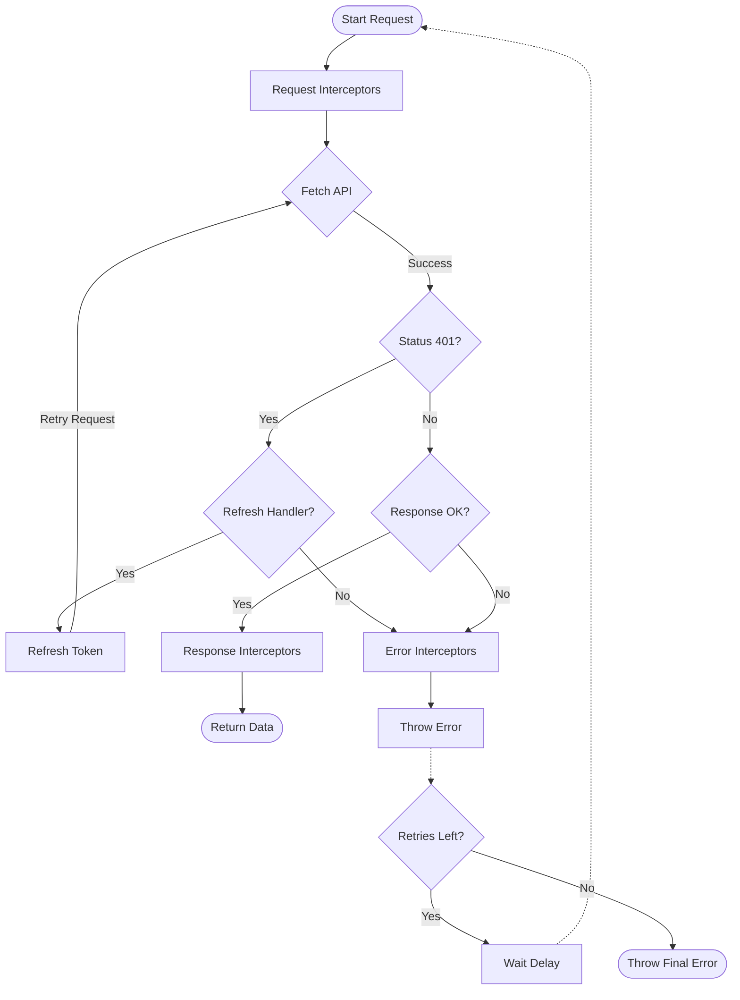

# q-api

<div align="center">

```text
   ___             _    ____  ____
  / _ \           / \  |  _ \|_  _|
 | | | |  _____  / _ \ | |_) | | |
 | |_| | |_____|/ ___ \|  __/  | |
  \__\_\       /_/   \_\_|    |___|
```

**Lightweight · Type-Safe · Powerful**

A modern, zero-dependency HTTP client for TypeScript & JavaScript applications. Built with `fetch`, designed for developers.

[](https://www.npmjs.com/package/q-api)
[](https://opensource.org/licenses/MIT)
[](https://www.typescriptlang.org/)
[]()

</div>

---

## 🚀 Why q-api?

`q-api` is designed to be a drop-in replacement for complex fetching libraries while keeping the bundle size tiny. It wraps the standard `fetch` API with powerful features often needed in production apps:

- ✅ **Type-Safe**: First-class TypeScript support with generics.
- 🔄 **Interceptors**: Middleware for requests, responses, and errors.
- 🛡️ **Auto-Refresh Auth**: Built-in logic to handle 401s and refresh tokens seamlessy.
- 🔁 **Automatic Retries**: Configurable retry logic with exponential backoff.
- 📂 **File Uploads**: Native support for file uploads with progress tracking.
- ⚡ **Lightweight**: Zero external dependencies.

## 📦 Installation

```bash
# using pnpm
pnpm add q-api

# using npm
npm install q-api

# using yarn
yarn add q-api
```

## 🧠 How it Works

Here is a high-level overview of the request lifecycle in `q-api`:



## 🛠️ Usage

### Basic Request

```typescript
import { api } from 'q-api';

interface User {
  id: number;
  name: string;
}

// Fully typed response
const users = await api.get<User[]>('/users');

const newUser = await api.post<User>('/users', { name: 'Alice' });
```

### Interceptors

Intercept requests to add necessary headers (like Authorization) or log activity.

```typescript
import { addRequestInterceptor, addResponseInterceptor } from 'q-api';

// Add Auth Token to every request
addRequestInterceptor((url, options) => {
  const token = localStorage.getItem('token');
  if (token) {
    options.headers = {
      ...options.headers,
      Authorization: `Bearer ${token}`,
    };
  }
  return [url, options]; // Must return generic tuple [url, options]
});

// Transform or Log Responses
addResponseInterceptor(async (response, data) => {
  console.log(`Received status: ${response.status}`);
  return data;
});
```

### Automatic Token Refresh 🔐

Handle expired access tokens automatically without disrupting the user experience.

```typescript
import { setRefreshTokenHandler } from 'q-api';

// Define how to get a new token
setRefreshTokenHandler(async () => {
  const res = await fetch('/auth/refresh-token');
  const { accessToken } = await res.json();

  // Save new token
  localStorage.setItem('token', accessToken);

  return accessToken; // Return the new token string
});

// Now, if any request returns 401, q-api will:
// 1. Pause the request
// 2. Call your handler to get a new token
// 3. Retry the original request automatically
```

### Automatic Retries 🔁

Make your application resilient to network blips.

```typescript
// Retry up to 3 times with exponential backoff
const data = await api.get('/unstable-endpoint', {
  retries: 3,
  retryDelay: 1000, // Start with 1s delay (1s, 2s, 4s)
});
```

### File Uploads 📤

Upload files easily with `FormData` handling handled for you.

```typescript
import { upload } from 'q-api';

const fileInput = document.querySelector('#file') as HTMLInputElement;
const files = fileInput.files;

if (files) {
  try {
    const response = await upload('/api/upload', Array.from(files), {
      headers: { 'X-Custom-ID': '123' },
    });
    console.log('Upload complete!', response);
  } catch (err) {
    console.error('Upload failed', err);
  }
}
```

### Cancellation 🛑

Cancel requests using the standard `AbortController`.

```typescript
const controller = new AbortController();

const promise = api.get('/long-task', {
  signal: controller.signal,
});

// Cancel the request
controller.abort();
```

## 📚 API Reference

### `api` Object

- `api.get<T>(url, options?)`
- `api.post<T>(url, body?, options?)`
- `api.put<T>(url, body?, options?)`
- `api.patch<T>(url, body?, options?)`
- `api.delete<T>(url, options?)`

### Utils

- `upload(url, files[], options?)`
- `addRequestInterceptor(fn)`
- `addResponseInterceptor(fn)`
- `addErrorInterceptor(fn)`
- `setRefreshTokenHandler(fn)`

## 📄 License

MIT © [Raja Dubey](https://github.com/rajadubey)
